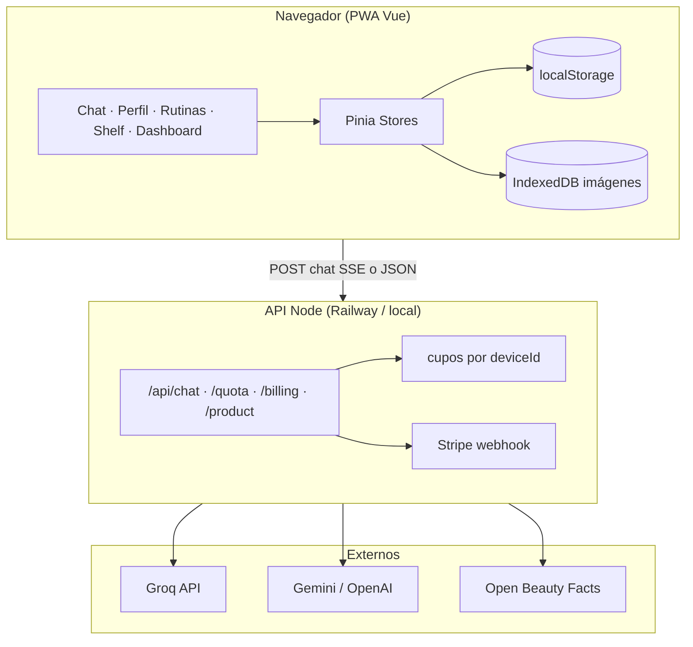
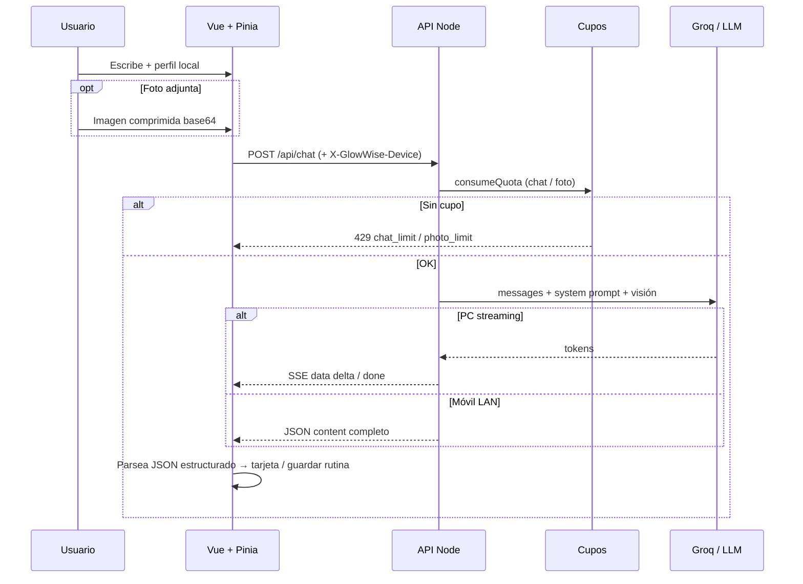
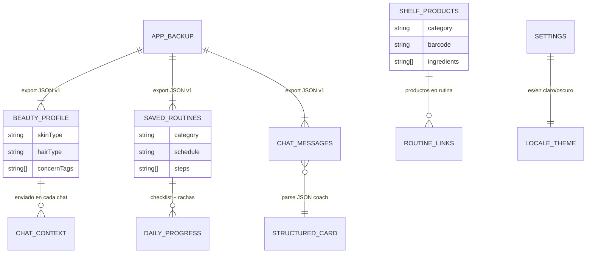

# GlowWise — AI Beauty Coach

> **Conocerte, cuidarte, aceptarte** — PWA de coaching de belleza con IA (skincare, maquillaje, cabello y rutinas).

[](https://glow-wise-six.vercel.app)

**Probar la app:** [https://glow-wise-six.vercel.app](https://glow-wise-six.vercel.app)

Este repositorio es la **ficha pública de portfolio** (case study + referencia técnica). El **código fuente** vive en un repositorio privado por claves de API, lógica de cupos y Stripe.

---

## Tabla de contenidos

1. [Resumen para reclutadores](#1-resumen-para-reclutadores)
2. [Qué es GlowWise](#2-qué-es-glowwise)
3. [Stack y despliegue](#3-stack-y-despliegue)
4. [Arquitectura](#4-arquitectura)
5. [Módulos y rutas](#5-módulos-y-rutas)
6. [Datos y privacidad](#6-datos-y-privacidad)
7. [IA: chat, visión y respuestas estructuradas](#7-ia-chat-visión-y-respuestas-estructuradas)
8. [Backend (API Node)](#8-backend-api-node)
9. [Decisiones de diseño](#9-decisiones-de-diseño)
10. [Guía rápida para entrevistas](#10-guía-rápida-para-entrevistas)
11. [Preguntas frecuentes (respuestas cortas)](#11-preguntas-frecuentes-respuestas-cortas)
12. [Elevator pitch (30 s)](#12-elevator-pitch-30-s)

---

## 1. Resumen para reclutadores

| | |
|---|---|
| **Tipo** | Producto web full-stack · PWA · integración LLM multimodal |
| **Rol típico** | Diseño e implementación frontend + API Node + despliegue (Vercel + Railway) |
| **Frontend** | Vue 3, TypeScript, Pinia, Vue Router, Tailwind v4, vue-i18n, Zod, PWA |
| **Backend** | Node (HTTP nativo), proxy a Groq / Gemini / OpenAI, cupos, Stripe |
| **IA** | Chat streaming (SSE en PC), visión (fotos), JSON estructurado → rutinas guardables |
| **Datos** | **Local-first** (localStorage + IndexedDB para imágenes); solo chat/fotos van al proveedor IA |
| **Demo** | Frontend en Vercel; API en Railway; claves solo en servidor |

**Diferenciadores:** producto completo (no solo chat), hábitos (rachas, checklist diario), estantería de productos con escaneo, monetización opcional (Stripe Plus), bilingüe es/en.

---

## 2. Qué es GlowWise

GlowWise es una **SPA** que actúa como coach de belleza personal:

- **Chat con IA** personalizado según perfil (tipo de piel/cabello, preocupaciones, notas).
- **Foto adjunta** para análisis visual (textura, maquillaje, cabello visible) vía modelo de visión.
- **Rutinas** creadas a mano o **guardadas en un clic** desde respuestas estructuradas del coach.
- **Dashboard** con rachas, calendario semanal, progreso del día y accesos rápidos.
- **Estantería (shelf)** de productos propios, conflictos entre activos, enlace con rutinas, escaneo código de barras / foto.
- **Progreso fotográfico** (evolución en el tiempo, local).
- **Paths / guías** editoriales por tema.
- **Cuenta local** con cupos de uso (plan free vs Plus vía Stripe).
- **Backup JSON** export/import — el usuario es dueño de sus datos.

No sustituye diagnóstico médico; el system prompt acota a **coaching cosmético**.

---

## 3. Stack y despliegue

| Capa | Tecnología |
|------|------------|
| UI | Vue 3 (Composition API), TypeScript, Vite 8 |
| Estado | Pinia + `pinia-plugin-persistedstate` |
| Routing | Vue Router 5 |
| Estilos | Tailwind CSS v4, tema claro/oscuro |
| i18n | vue-i18n (es / en) |
| Validación | Zod (schemas compartidos cliente ↔ servidor) |
| Utilidades | @vueuse/core, jsPDF (export chat), ZXing (códigos de barras) |
| API dev/prod | Node (`tsx`), puerto 3001; proxy Vite `/api` en local |
| IA default | **Groq** — texto `openai/gpt-oss-120b`, visión `qwen/qwen3.6-27b` |
| IA alt. | Gemini, OpenAI; modo **demo** sin clave |
| Prod opcional | Supabase Edge Function `beauty-chat` |
| Pagos | Stripe Checkout + webhook (plan Plus) |
| PWA | `manifest.webmanifest` + service worker (build producción) |

**Demo pública:**

| Pieza | Dónde |
|-------|--------|
| Frontend | [Vercel](https://glow-wise-six.vercel.app) |
| API + Groq | Railway (variables de entorno; **nunca** claves en el frontend) |

Desarrollo local: `yarn go` arranca Vite + API e imprime URLs para PC y móvil en la misma WiFi.

---

## 4. Arquitectura

### 4.1 Vista general



### 4.2 Flujo de un mensaje de chat



### 4.3 Esquema de persistencia (local-first)



Claves típicas en `localStorage`: `aibeauty.profile`, `aibeauty.chat`, `aibeauty.routines`, `aibeauty.settings`, `aibeauty.account`, `glowwise.deviceId`.

---

## 5. Módulos y rutas

| Ruta | Módulo | Función principal |
|------|--------|-------------------|
| `/` | Chat | Coach IA, foto, sugerencias, export PDF/MD, comparar rutinas |
| `/profile` | Perfil | Piel/cabello/maquillaje, chips de preocupación, foto → chat |
| `/routines` | Rutinas | CRUD, favoritas, pin AM/PM/semanal, import/export MD, checklist |
| `/shelf` | Estantería | Productos, escaneo, conflictos de ingredientes, fotos |
| `/dashboard` | Dashboard | Rachas, calendario, feedback semanal, accesos rápidos |
| `/paths` | Guías | Contenido editorial por “paths” |
| `/settings` | Ajustes | Backup `.json`, borrado total, recordatorios |
| `/account` | Cuenta | Cupo mensual, email local, Plus Stripe |
| `/about` | Marca | Historia y tesis del producto |
| `/legal` | Legal | Privacidad, términos, aviso de salud |

**Onboarding:** primera visita puede redirigir de chat → perfil hasta completar landing inicial.

**Stores Pinia:** `chat`, `profile`, `routines`, `shelf`, `settings`, `account`, `photoProgress`.

---

## 6. Datos y privacidad

| Dato | Dónde | ¿Sale del dispositivo? |
|------|-------|-------------------------|
| Perfil, rutinas, shelf, progreso | localStorage / IndexedDB | **No** (salvo backup manual del usuario) |
| Historial de chat persistido | localStorage | **No** hasta que el usuario envía un mensaje |
| Mensaje + perfil + imagen en chat | Red → API → **Groq/etc.** | **Sí** (proveedor IA) |
| `X-GlowWise-Device` | Header a tu API | **Sí** (cupos / Stripe Plus por dispositivo) |
| API keys Groq/Stripe | `.env` servidor | **Nunca** al frontend |

**Detalle UX:** Chrome y el navegador integrado de Cursor son orígenes distintos → no comparten datos; se documenta banner + export/import JSON.

---

## 7. IA: chat, visión y respuestas estructuradas

**Entrada validada (Zod):** hasta ~40 mensajes, `locale`, `profile` opcional, `image` opcional (JPEG/PNG/WebP comprimido en cliente).

**Salida:**

- Texto del coach (markdown).
- Bloque JSON opcional parseado en cliente (`beautyStructuredSchema`):

```json
{
  "category": "skincare | makeup | hair | routine | general",
  "tips": ["..."],
  "routineTitle": "...",
  "caution": "...",
  "products": [{ "name": "...", "why": "..." }]
}
```

→ UI **ChatStructuredCard** → botón **Guardar como rutina**.

**Streaming:** SSE en escritorio; header `X-GlowWise-Buffer: 1` fuerza respuesta JSON completa (móvil / LAN más estable).

**Visión:** foto de piel/maquillaje/cabello o producto; requiere proveedor con visión (Groq Qwen por defecto).

**Modo demo:** respuestas estáticas con JSON de ejemplo si no hay clave — útil para workshops sin coste.

---

## 8. Backend (API Node)

| Endpoint | Uso |
|----------|-----|
| `GET /api/health` | Proveedor activo, modelo, visión disponible |
| `GET /api/quota` | Chats/fotos restantes del mes (plan free) |
| `POST /api/chat` | Chat SSE o JSON |
| `POST /api/billing/checkout` | Stripe Checkout (Plus) |
| `POST /api/billing/confirm` | Vuelta desde Stripe |
| `POST /api/billing/portal` | Portal cliente |
| `POST /api/billing/webhook` | Suscripción activa/cancelada |
| `POST /api/waitlist` | Lista de espera (email) |
| `GET /api/product/:barcode` | Proxy Open Beauty / Open Food Facts |

**Cupos (free):** orden de magnitud **15 chats / 2 fotos** por mes por `deviceId` (UTC); se comprueba **antes** de llamar al LLM. Plus (Stripe) o lista `QUOTA_PLUS_DEVICES` desactiva tope. `QUOTA_DISABLED=1` en local para desarrollo.

**Multi-proveedor:** `server/provider.ts` conmuta Groq / Gemini / OpenAI / demo; prompts en `server/prompts.ts` inyectan perfil, idioma y reglas de visión.

---

## 9. Decisiones de diseño

1. **Local-first:** reduce fricción legal y de infra; el usuario exporta backup; no hay BD propia de usuarios (todavía).
2. **Proxy Node:** una sola capa para claves, cupos, Stripe y CORS; el frontend solo conoce `/api`.
3. **Zod compartido:** mismos contratos en cliente y servidor → menos bugs en chat e imágenes.
4. **SSE vs buffer:** UX fluida en PC; robustez en móvil Safari / LAN.
5. **Structured output en markdown:** el LLM no necesita function-calling nativo; parse tolerante en cliente.
6. **PWA:** instalable; SW solo en producción para no romper HMR en dev.
7. **i18n desde día uno:** mercado es/en sin duplicar vistas.

---

## 10. Guía rápida para entrevistas

### Qué problemas resuelve

- Consejo de belleza **personalizado** sin app de marca única.
- **Rutinas accionables** (no solo texto): guardar, pin AM/PM, checklist y rachas.
- **Inventario de productos** y alertas de conflicto entre ingredientes.
- **Privacidad por defecto:** datos de hábito en el dispositivo; IA solo cuando el usuario chatea.

### Qué destacar según el puesto

| Puesto | Ángulo |
|--------|--------|
| **Frontend** | Vue 3 modular, Pinia persistido, streaming UX, PWA, i18n, Tailwind, composables (`useBeautyChat`, backup) |
| **Full-stack** | API Node sin framework pesado, Zod, multi-proveedor IA, Stripe + webhooks, despliegue Vercel/Railway |
| **IA / applied** | Prompting con perfil, visión multimodal, JSON estructurado, cupos anti-abuso, modo demo |
| **Producto** | Onboarding, free tier + Plus, local-first + export, legal/health disclaimers |

### Métricas / complejidad (cualitativas)

- **~10 rutas** funcionales, **7 stores**, módulos por dominio (`modules/chat`, `routines`, `shelf`…).
- **3 idiomas de integración IA** (Groq/Gemini/OpenAI) detrás de una interfaz común.
- **Flujos móvil:** LAN dev, buffer chat, borrador foto en `sessionStorage` al abrir cámara.

### Riesgos que ya contemplaste (di en voz alta)

- Datos en LLM = política de privacidad clara; no guardar chat en servidor propio.
- Cupos en archivo local Railway → puede resetear sin volumen persistente.
- No es diagnóstico médico → copy legal + prompt.

---

## 11. Preguntas frecuentes (respuestas cortas)

**¿Por qué Vue y no React?**  
Producto construido en ecosistema Vue 3 + Pinia; Composition API, tipado fuerte y Vite 8.

**¿Dónde está la base de datos?**  
No hay BD de usuarios: **localStorage** + **IndexedDB** (imágenes). Cupos/waitlist en ficheros servidor (`.data/`).

**¿Cómo evitas que quemen tu API key en la demo pública?**  
Clave solo en Railway; cupos por `deviceId`; modo demo; opción Plus.

**¿Cómo personalizas sin login?**  
Perfil en localStorage se adjunta a cada `POST /api/chat`.

**¿Cómo conviertes respuesta IA en rutina?**  
Regex/parse de bloque JSON → validación Zod → store `routines`.

**¿Streaming?**  
`text/event-stream` en PC; móvil pide respuesta buffered.

**¿Stripe sin usuarios cloud?**  
Plus ligado a **`X-GlowWise-Device`** + webhook actualiza estado en servidor.

**¿Open source?**  
Código en repo **privado**; esta ficha + demo públicas para reclutadores.

**¿Relación con TonoLab?**  
Proyecto separado (misma línea de producto belleza; GlowWise es marca propia).

**¿Qué mejorarías en v2?**  
Sync opcional con cuenta, tests e2e del chat, persistencia de cupos en Redis/Supabase, observabilidad.

---

## 12. Elevator pitch (30 s)

> GlowWise es una PWA de coaching de belleza con IA. El usuario define su perfil, chatea con un coach que entiende texto y fotos, y convierte consejos en rutinas con checklist y rachas. Los productos van a una estantería con escaneo y alertas de ingredientes. Casi todo vive en el navegador; solo el chat pasa por una API Node que protege las claves, aplica cupos y opcionalmente Stripe. Está desplegada en Vercel con backend en Railway — puedes probarla ahora mismo en el enlace de arriba.

---

## Enlaces

- **Demo:** [glow-wise-six.vercel.app](https://glow-wise-six.vercel.app)
- **Autor:** [github.com/adrianchange](https://github.com/adrianchange)
- **Código:** repositorio privado (disponible bajo solicitud en procesos de selección)

---

## Tags

`vue3` · `typescript` · `pwa` · `groq` · `llm` · `local-first` · `pinia` · `stripe` · `beauty-tech` · `full-stack`
